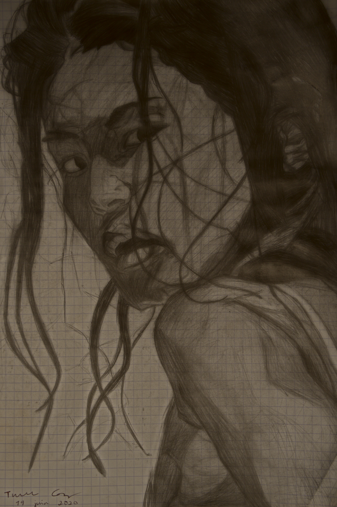
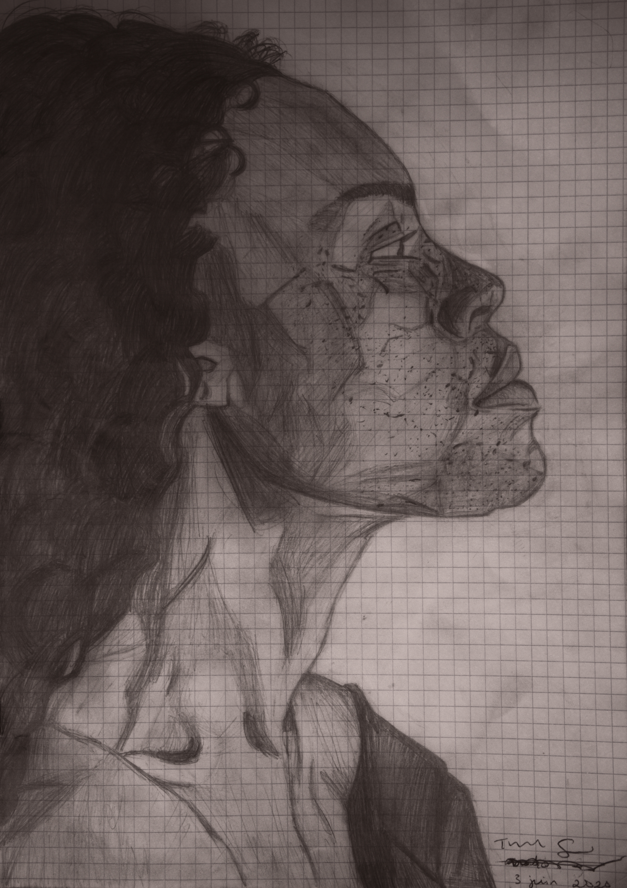
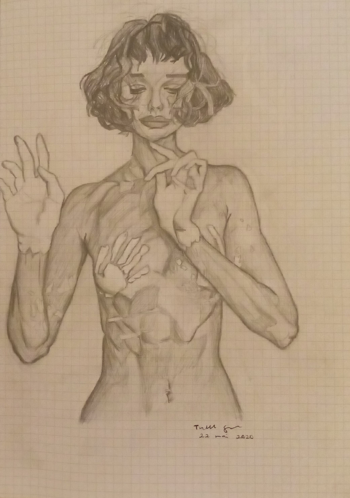
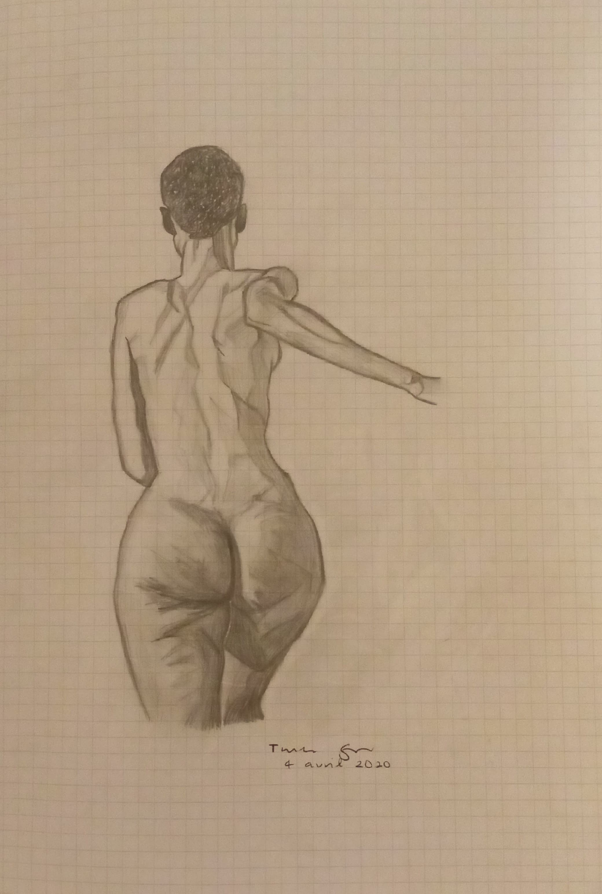
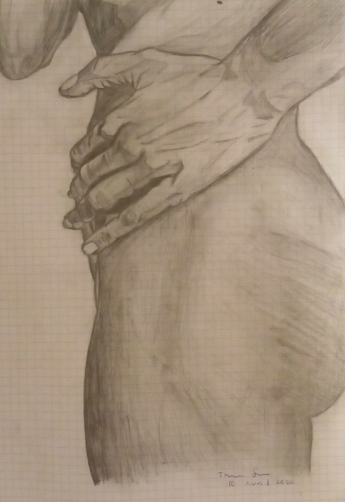

## Art

Some of my art:

Jean Pierrot's photography</a>">

Nick Tsirogiannidis' photography</a>">

Mehran Djojan's photography</a>">

Jean Pierrot's photography</a>">

Cora.life</a>">

<!-- The Modal -->

  <!-- The Close Button -->
  &times;

  <!-- Modal Content (The Image) -->
  

  <!-- Modal Caption (Image Text) -->
  

  
&#10095;

  
&#10094;

