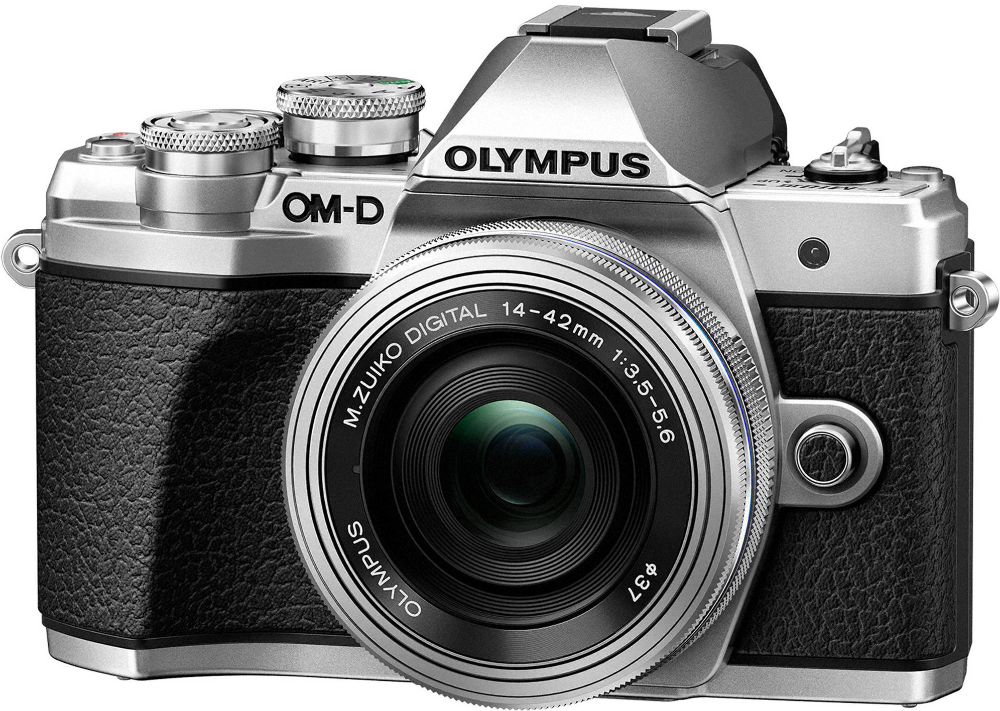
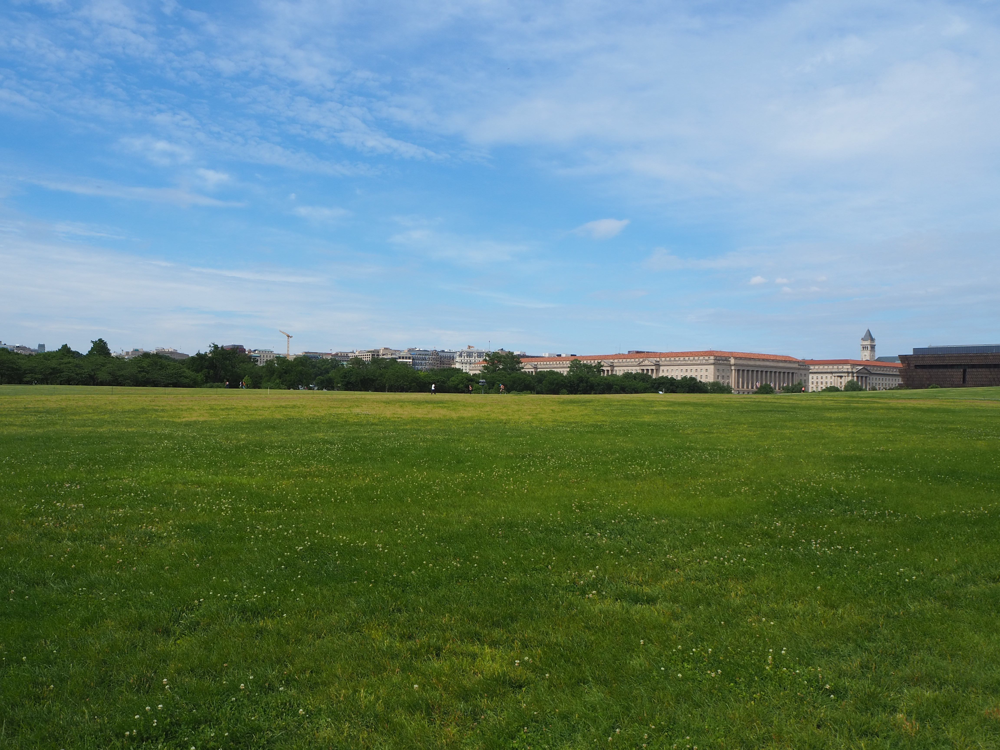
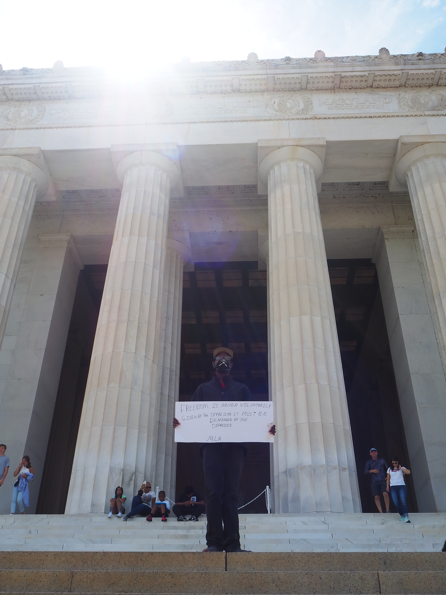
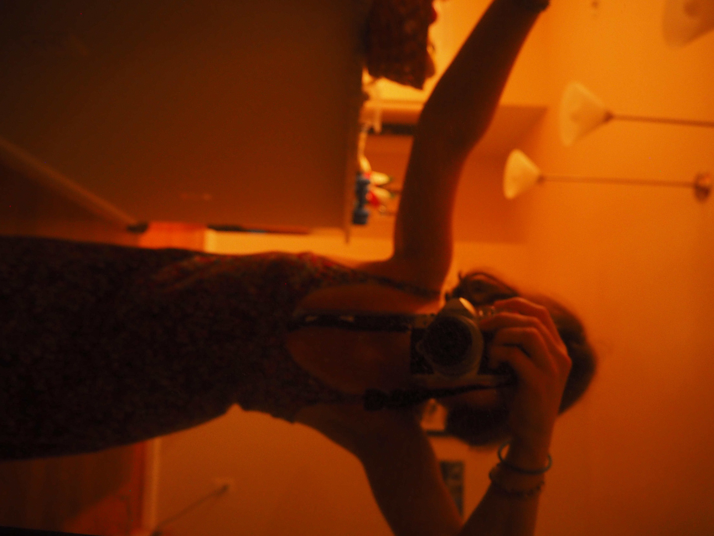

## Photography

### Background

<a href="https://www.google.com/url?sa=i&url=https%3A%2F%2Fwww.bhphotovideo.com%2Fc%2Fproduct%2F1351009-REG%2Folympus_v207072su010_om_d_e_m10_mark_iii.html&psig=AOvVaw2hzZURvu9a_ftCwXZ4k1pd&ust=1592582233181000&source=images&cd=vfe&ved=0CAIQjRxqFwoTCIDh8KTdi-oCFQAAAAAdAAAAABAW">from B&H</a>

I recently bought the E-M10 Mark III Olympus Mirrorless Camera and have been experimenting with it. Here is a collection of my amateur photography.

### Time Lapses

### Photos

