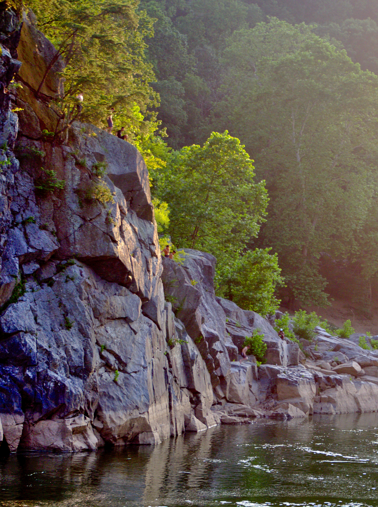
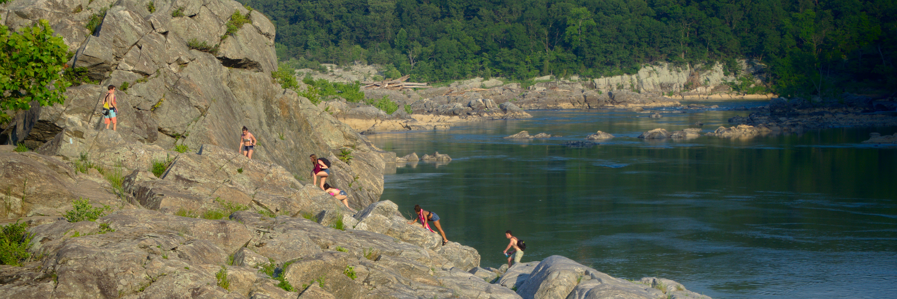
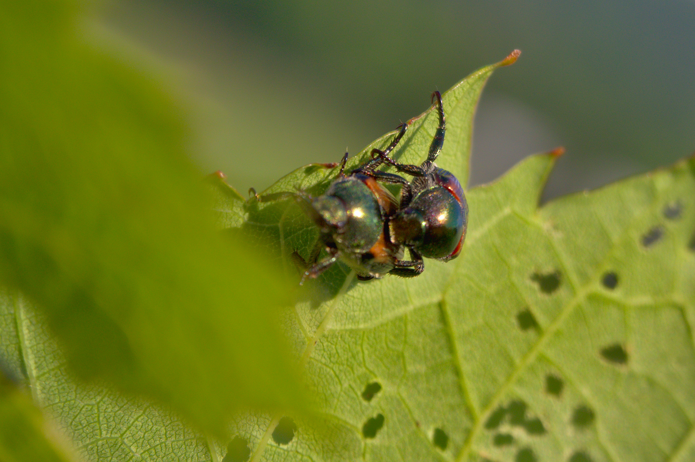
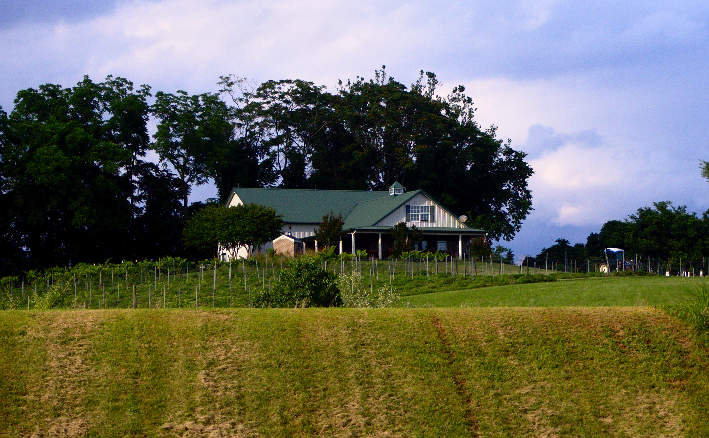

## Photography

<a href="https://getolympus.com/digitalcameras/omd/e-m10-mark-iii.html" target="_blank">Olympus   E-M10 Mark III</a>

I recently bought the E-M10 Mark III Olympus Mirrorless Camera and have been experimenting with it. Here is a collection of my amateur photography. Need to work on my ISO...

Eye of the Hurricane

Monet

Jump

Watercolors

Reflect

Climb

Pixels

Sex

Horse

Tree

Wine

House

Helping Hand

Quarantined

Legos

#BLM

<!-- The Modal -->

  <!-- The Close Button -->
  &times;

  <!-- Modal Content (The Image) -->
  

  <!-- Modal Caption (Image Text) -->
  

  
&#10095;

  
&#10094;

