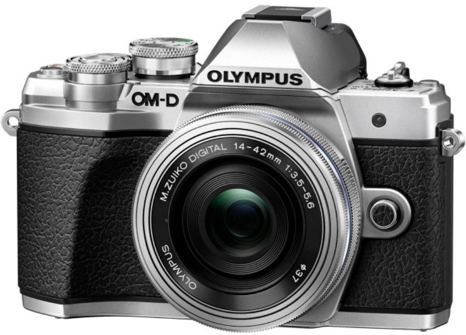
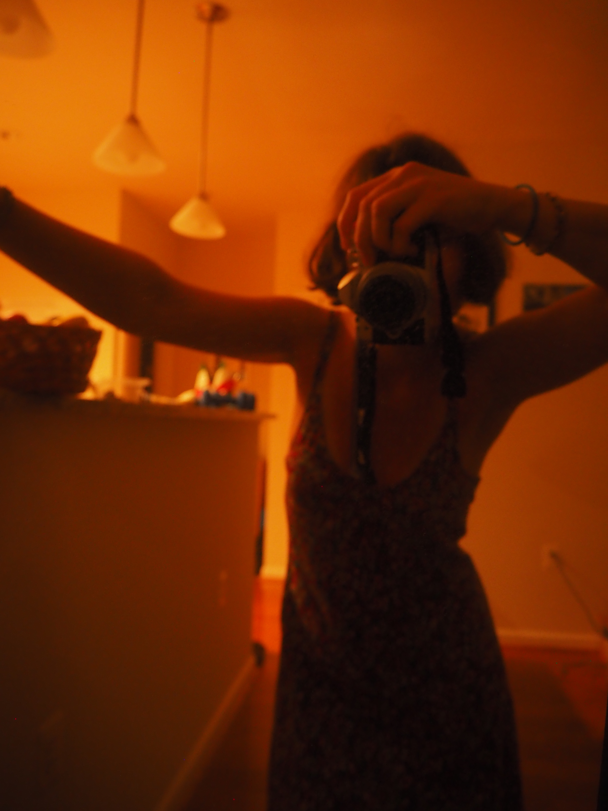
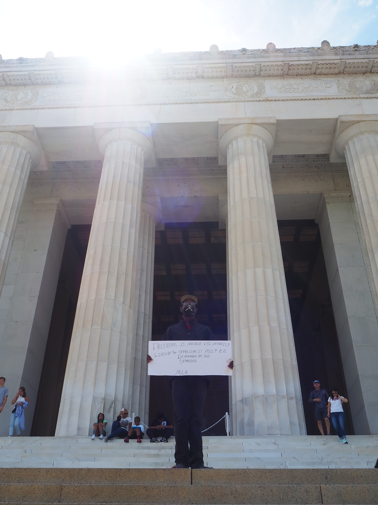

## Photography

### Background

<a href="https://getolympus.com/digitalcameras/omd/e-m10-mark-iii.html">from Olympus</a>

I recently bought the E-M10 Mark III Olympus Mirrorless Camera and have been experimenting with it. Here is a collection of my amateur photography.

### Time Lapses

### Photos

<!-- The Modal -->

  <!-- The Close Button -->
  &times;

  <!-- Modal Content (The Image) -->
  

  <!-- Modal Caption (Image Text) -->
  

